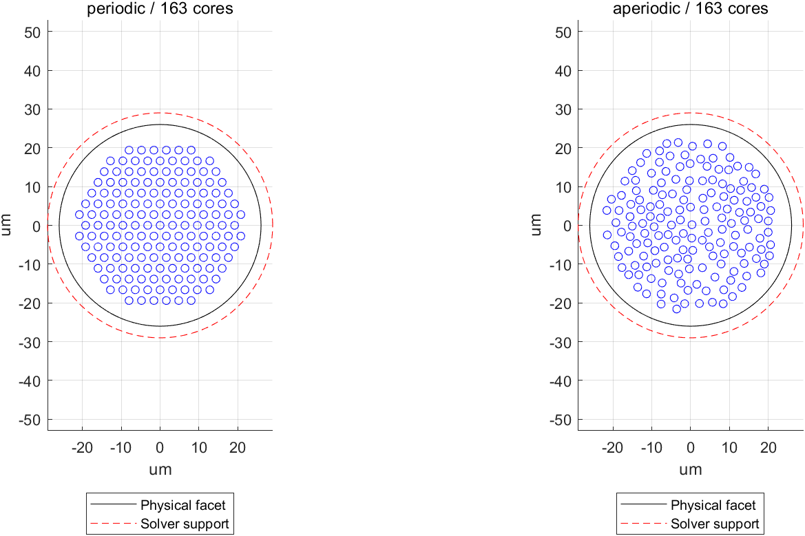
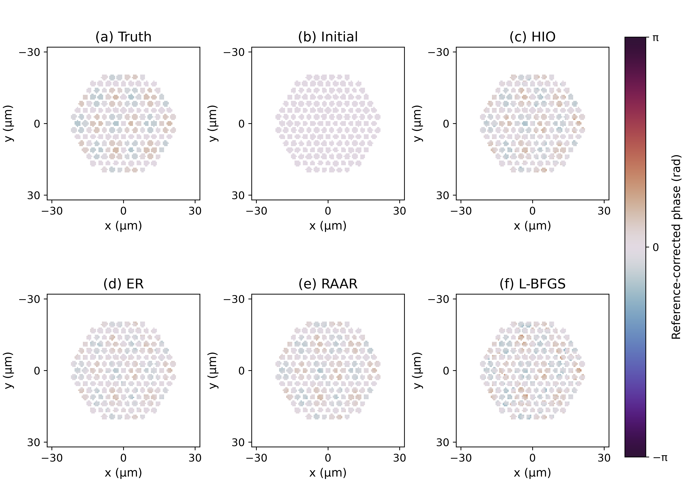
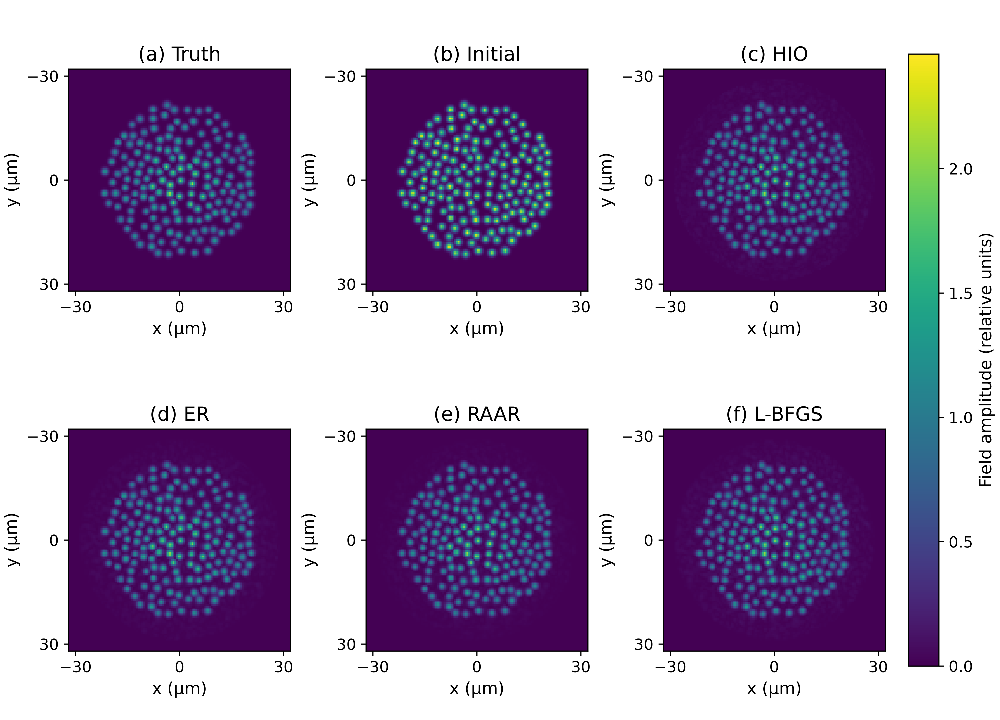
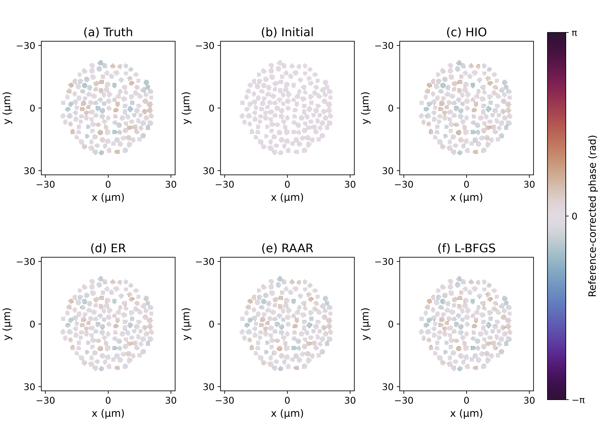
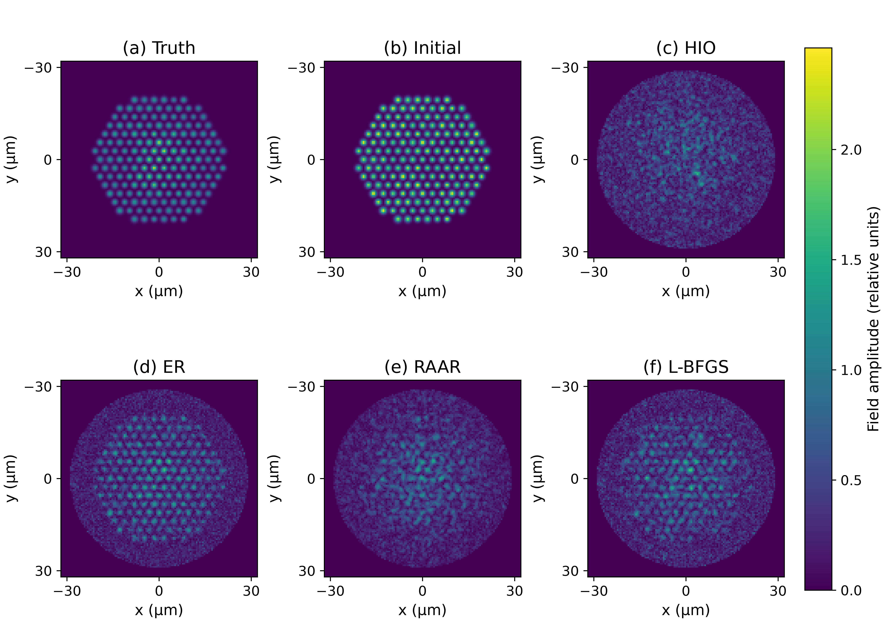
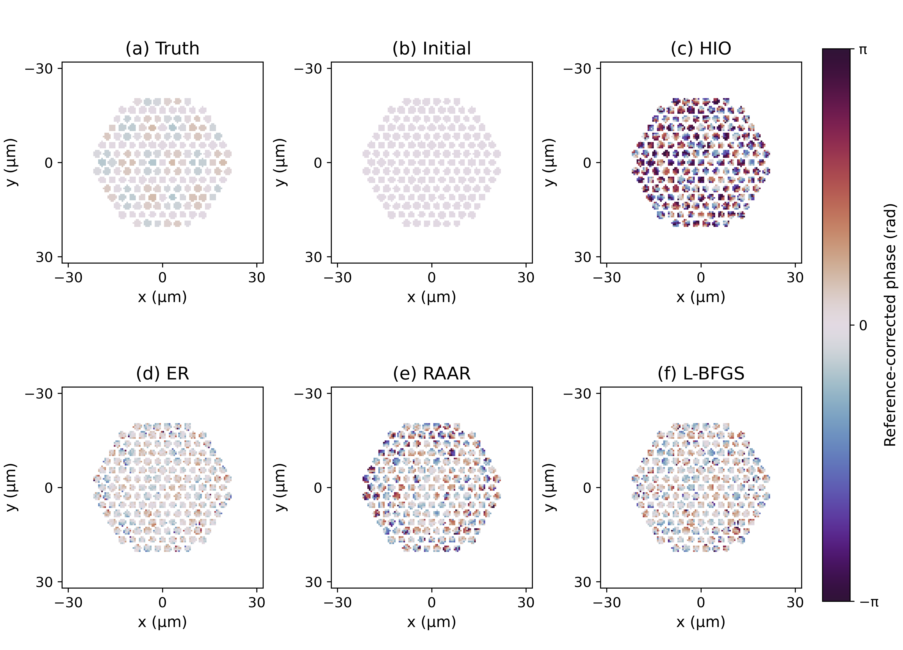
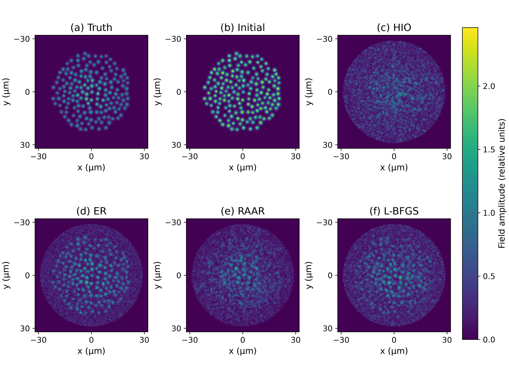
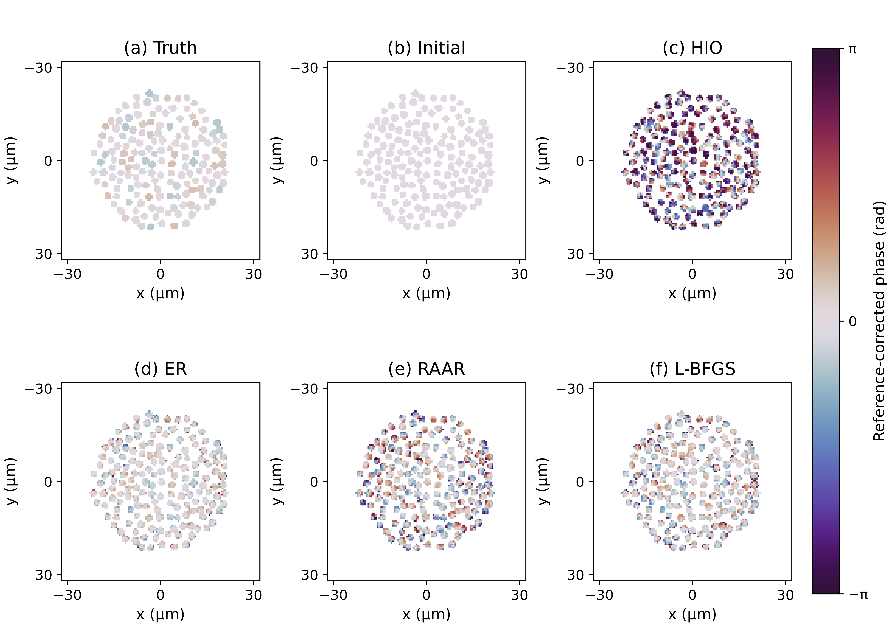

# 圆形端面多芯光纤：四方法比较

阶段汇报｜2026年10月4日修订｜呈佳伟老师

佳伟老师：本阶段完成了圆形端面多芯光纤（MCF）的周期与非周期两类模拟，并在统一输入、初值和传播预算下比较 HIO、ER、RAAR 与 L-BFGS。16 项求解任务全部完成，几何检查和数值测试均通过。

## 主要发现

1. 无噪声时，两类布局均以 RAAR 的复场误差最低。

2. 含噪声时，四种算法中 ER 的复场误差最低；但从 80 次增加到 200 次传播后，误差反而上升。

3. 含噪声时，四种算法的相位误差均高于初始参考。当前结果提示，应继续检查噪声处理与停止准则。

## 核心结果：复场误差，越小越好

|布局 / 测量|初始参考|HIO|ER|RAAR|L-BFGS|
|---|---|---|---|---|---|
|周期 / 无噪声|0.6555|0.1489|0.1475|0.1182|0.2123|
|非周期 / 无噪声|0.6739|0.1267|0.1292|0.1027|0.1523|
|周期 / 含噪声|0.6555|1.3988|0.6313|0.9480|0.8608|
|非周期 / 含噪声|0.6739|1.3830|0.6231|0.9260|0.8542|

复场误差（NRMSE）衡量恢复的振幅与相位整体偏差，仅对齐一个全局相位。四算法均使用 200 次传播；“初始参考”为共同起点，未做迭代。

## 增加计算量未改善含噪声结果

|含噪声 ER|80 次传播|200 次传播|
|---|---|---|
|周期|0.5487|0.6313|
|非周期|0.5495|0.6231|

本轮为固定种子、单个混合样品的合成试运行，采用已知参考复场；上述比较限于本轮条件。

请佳伟老师指导下一阶段的工作重点。

# 模型、比较条件与材料索引

图1｜本次运行的实际布局。左：周期排列；右：非周期排列。黑实线为物理端面，红虚线为算法支持域（允许恢复光场的区域），蓝圈为纤芯。两组均为 163 芯，坐标单位为微米。

## 共同条件

物理端面半径 26 微米，芯中心范围 22 微米，算法支持域半径 29 微米。周期组芯间距 3.2 微米；非周期组最小芯间距 2.4 微米。端面外场能量检查为零。

计算量按传播调用次数统一计数，包含 L-BFGS 线搜索中的拒绝试探；记录 80、200 次两个预算点。参数在评分前固定。四方法计算、评分及绘图共 32.62 秒，不含输入生成。

两类布局使用同一混合样品、已知合成参考校准和共同初始化规则。噪声模型及本轮实际计数见下一页；第4—11页分别展示振幅与相位。

## 阅读与复跑

[私有项目仓库（需访问权限）](https://github.com/BoVVENGibNieAuf/LSA-FAST-Phase-Retrieval-Benchmark)

[完整结果包与校验信息](https://github.com/BoVVENGibNieAuf/LSA-FAST-Phase-Retrieval-Benchmark/releases/tag/circular-results-2026-10-03)

复跑入口：START_CIRCULAR_BENCHMARK.cmd。需要已激活的 MATLAB。本机运行与结果包恢复已验证；全新下载副本的 MATLAB 复跑尚未验证。完整方法卡见 docs/methods/FAST_四类求解器方法卡.docx。

# 噪声定义与本轮实际强度

## 从无噪声强度到求解器输入

令 I_p 为探测器第 p 个像素的无噪声强度（细网格传播后进行像素平均），I_ref,p 为空白参考帧强度。曝光换算系数 α = 200000 / Σ_p I_ref,p，本轮两种布局均约为 50。

散粒噪声：K_p ~ Poisson(μ_p)，μ_p = α I_p。读出噪声：ε_p ~ N(0, σ_r^2)，σ_r = 1 电子/像素（标准差）。两者独立，按像素独立采样。

相机读数 Y_p = K_p + ε_p；非负处理 C_p = max(Y_p, 0)；输入振幅 A_p = sqrt(C_p / α)。无噪声对照直接使用 A_p = sqrt(I_p)。

## “20 万”的准确含义

20 万指整个空白参考帧的总期望光电子数，定义曝光尺度。256 × 256 像素下，空白帧每像素平均为 3.052 电子；样品透射损耗使样品帧总期望计数降低。这里未单独建模量子效率，不能直接解释成入射光子数。

|布局|样品总期望电子|每像素均值|负读数比例|
|---|---|---|---|
|周期|84114.1|1.283|39.19%|
|非周期|82522.7|1.259|38.90%|

表中计数由保存的无噪声输入与曝光系数计算；负读数比例取自运行时相机记录，分母为全部 65536 个像素。两布局的峰值期望计数分别为 68.85、92.03 电子/像素。

## 噪声统计与比较边界

截断前 E[Y_p] = μ_p，Var(Y_p) = μ_p + σ_r^2；因此散粒噪声随信号变化，不能用一个固定“百分比噪声”描述。负值截断会在暗区引入正偏，开方后也不再是加性高斯噪声。表中较高负读数比例包含大量暗像素。

相机代码为 fast_mcf_camera.m（泊松乘积采样），随机生成器为 MATLAB twister，实际种子 3102027。四算法复用同一保存的含噪输入；两布局同种子不代表相同计数实现。每条件仅一次噪声实现，未给出跨噪声重复的置信区间。参考校准为已知合成复场，未另加校准误差。

# 周期 / 无噪声｜振幅比较

六面板按真值、共同初值、HIO、ER、RAAR、L-BFGS 排列。四算法预算均为 200 次传播。坐标为端面位置；显示范围 ±32 微米，覆盖半径 29 微米支持域；完整网格宽 128 微米；所有振幅图共用色标，未逐图归一化。

# 周期 / 无噪声｜相位比较

参考校正相位为 arg[u · conj(u_ref) · exp(−iθ)]；θ 在评分 ROI 内对齐真值的一个全局相位。仅显示保存的亮芯 ROI，白色区域为未显示区域，不代表零相位。所有相位图统一为 [−π, π]。

# 非周期 / 无噪声｜振幅比较

六面板按真值、共同初值、HIO、ER、RAAR、L-BFGS 排列。四算法预算均为 200 次传播。坐标为端面位置；显示范围 ±32 微米，覆盖半径 29 微米支持域；完整网格宽 128 微米；所有振幅图共用色标，未逐图归一化。

# 非周期 / 无噪声｜相位比较

参考校正相位为 arg[u · conj(u_ref) · exp(−iθ)]；θ 在评分 ROI 内对齐真值的一个全局相位。仅显示保存的亮芯 ROI，白色区域为未显示区域，不代表零相位。所有相位图统一为 [−π, π]。

# 周期 / 含噪声｜振幅比较

六面板按真值、共同初值、HIO、ER、RAAR、L-BFGS 排列。四算法预算均为 200 次传播。坐标为端面位置；显示范围 ±32 微米，覆盖半径 29 微米支持域；完整网格宽 128 微米；所有振幅图共用色标，未逐图归一化。

# 周期 / 含噪声｜相位比较

参考校正相位为 arg[u · conj(u_ref) · exp(−iθ)]；θ 在评分 ROI 内对齐真值的一个全局相位。仅显示保存的亮芯 ROI，白色区域为未显示区域，不代表零相位。所有相位图统一为 [−π, π]。

# 非周期 / 含噪声｜振幅比较

六面板按真值、共同初值、HIO、ER、RAAR、L-BFGS 排列。四算法预算均为 200 次传播。坐标为端面位置；显示范围 ±32 微米，覆盖半径 29 微米支持域；完整网格宽 128 微米；所有振幅图共用色标，未逐图归一化。

# 非周期 / 含噪声｜相位比较

参考校正相位为 arg[u · conj(u_ref) · exp(−iθ)]；θ 在评分 ROI 内对齐真值的一个全局相位。仅显示保存的亮芯 ROI，白色区域为未显示区域，不代表零相位。所有相位图统一为 [−π, π]。
