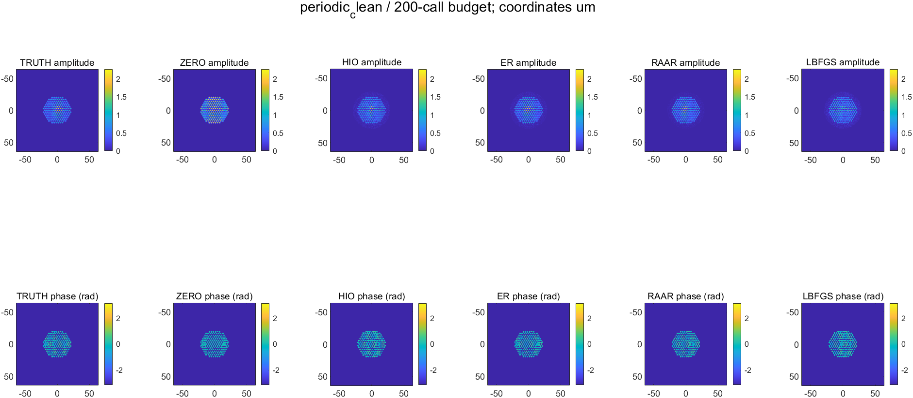
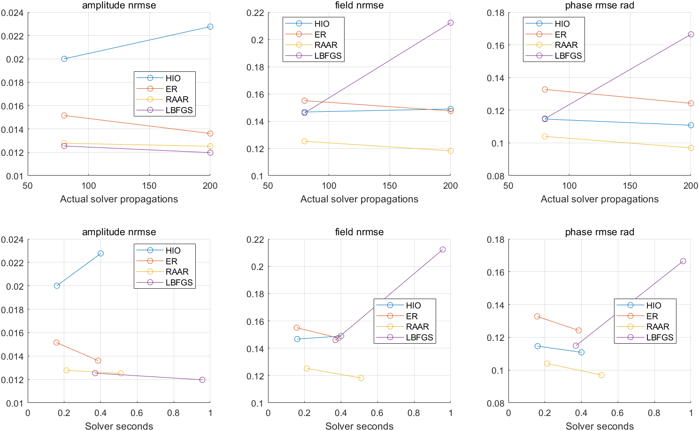
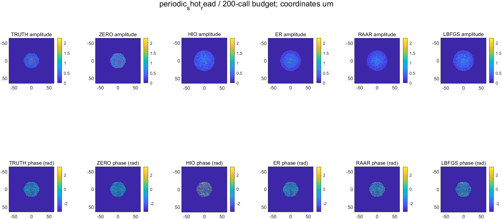
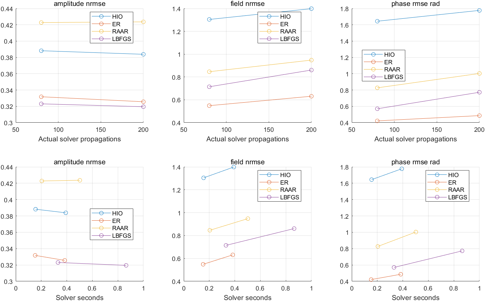
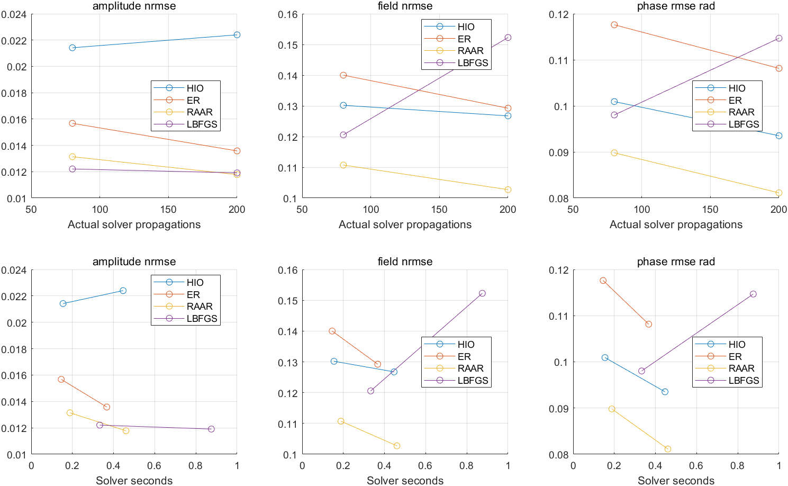
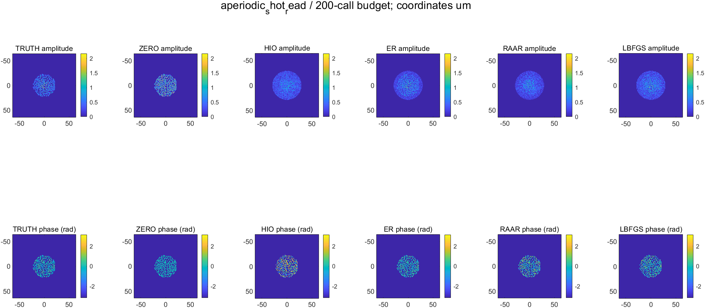
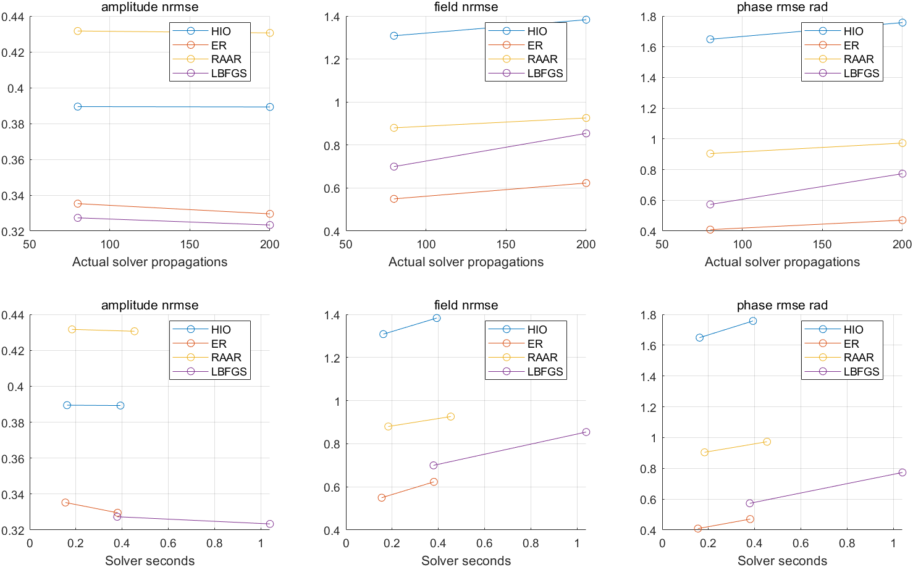

# 圆形端面 MCF 四方法阶段汇报

2026-10-03｜已完成运行结果版

## 一、已完成工作与结论

完成周期与非周期两类圆形端面模拟、四求解器统一比较及零迭代对照。16/16 个求解任务完成，失败数为0；保存32个预算结果和4个零迭代结果。两组几何检查与数值测试均通过。

干净数据下，200次传播预算的复场误差以RAAR最低：周期组0.1182，非周期组0.1027。含噪数据下，四算法中ER最低：周期组0.6313，非周期组0.6231；80次预算时分别为0.5487、0.5495，增加预算后误差上升。

含噪条件下所有算法的相位误差均高于零迭代参考。L-BFGS的检测振幅残差虽低，复场误差仍较大。当前结果支持继续研究噪声适配与停止准则；算法普遍优劣仍需多种子、多样本验证。

## 二、模型与比较协议

物理端面半径26 μm、芯中心范围22 μm、共同算法支持域半径29 μm。周期组为圆内截取的六角晶格，间距3.2 μm；非周期组为固定种子随机排布，最小芯间距2.4 μm。两组均163芯，端面外场能量检查均为0。圆形边界描述物理端面，离散芯阵列在有限采样下仍有阶梯边缘。

使用已知合成参考校准、相同传播算子与初始化规则；总参考光子数200000，读出噪声标准差1电子。固定几何种子20261031、传输种子20261003；混合样品、干净与散粒/读出噪声各一组。CPU double，MATLAB R2024b Update 10。所有参数在评分前固定，无超参数搜索。

主比较按累计80、200次传播调用计费，线搜索及拒绝试探均计入。四求解器阶段含评分与绘图共32.62秒，该时间不含前置两类输入生成。

## 三、200次传播预算结果

复场NRMSE为物理输出与仿真真值的归一化二范数差，仅对齐一个全局相位；相位RMSE在预先固定的亮纤芯区域计算。振幅残差为检测面预测幅值与测量幅值的相对二范数差。

|布局/测量|方法|振幅残差|复场NRMSE|相位RMSE(rad)|求解秒|
|---|---|---:|---:|---:|---:|
|周期/干净|ZERO|0.5966|0.6555|0.2504|0.0000|
|周期/干净|HIO|0.0228|0.1489|0.1108|0.4002|
|周期/干净|ER|0.0136|0.1475|0.1242|0.3850|
|周期/干净|RAAR|0.0125|0.1182|0.0970|0.5100|
|周期/干净|LBFGS|0.0120|0.2123|0.1665|0.9565|
|周期/含噪|ZERO|0.7229|0.6555|0.2504|0.0000|
|周期/含噪|HIO|0.3838|1.3988|1.7770|0.3918|
|周期/含噪|ER|0.3256|0.6313|0.4861|0.3837|
|周期/含噪|RAAR|0.4237|0.9480|1.0032|0.5022|
|周期/含噪|LBFGS|0.3195|0.8608|0.7725|0.8647|
|非周期/干净|ZERO|0.6165|0.6739|0.2584|0.0000|
|非周期/干净|HIO|0.0224|0.1267|0.0935|0.4463|
|非周期/干净|ER|0.0136|0.1292|0.1082|0.3669|
|非周期/干净|RAAR|0.0118|0.1027|0.0811|0.4603|
|非周期/干净|LBFGS|0.0119|0.1523|0.1147|0.8750|
|非周期/含噪|ZERO|0.7374|0.6739|0.2584|0.0000|
|非周期/含噪|HIO|0.3893|1.3830|1.7575|0.3927|
|非周期/含噪|ER|0.3296|0.6231|0.4705|0.3804|
|非周期/含噪|RAAR|0.4306|0.9260|0.9729|0.4533|
|非周期/含噪|LBFGS|0.3234|0.8542|0.7733|1.0390|

ZERO为0次传播的共同参考初值，单独列作对照。各优化方法实际均用满200次传播。

## 四、实际运行图

图像来自本次MATLAB运行，保持原始数据与色标。恢复相位图展示参考校正相位；曲线仅连接80、200两个记录点。原图标题中的下划线被MATLAB显示为下标，条件以本节中文标题为准。

### 周期/干净

### 周期/含噪

### 非周期/干净

### 非周期/含噪

## 五、验证与范围

几何检查通过；两组输入生成测试通过；四求解器的梯度、RAAR公式、旧基线等价、预算计数、线搜索及提前停止测试通过。梯度方向检验误差2.8793e-11，旧基线等价误差0。已核对输入、真值和记录中的代码SHA-256；36条指标记录完整且调用预算合规。

本轮为单固定种子、单混合样品的合成工程试运行，参考复场已知。独立实测参考、开发/测试划分、多种子统计仍待完成。旧六角外轮廓运行保留为历史证据，与本轮分开。

## 六、复跑与交付

下载私有仓库后解压至可写目录，双击START_CIRCULAR_BENCHMARK.cmd；或在MATLAB执行 setup_project; run_fast_circular_benchmark。需要已激活MATLAB，模拟输入现场生成，不依赖旧作者MAT文件。成功后检查runs/latest_circular.json及对应status.json。

本次用户在Windows工程目录启动已成功完成；全新下载副本的数值复跑尚未执行。结果档案已逐文件校验并测试本地恢复；历史绝对路径保留作来源证据，跨机器复跑请使用顶层入口创建新运行。

完整MAT输入、评分真值、求解输出及中间检查点见同私有仓库 circular-results-2026-10-03 Release，恢复说明见CIRCULAR_RESTORE_zh.md。代码与可读结果在Git中；clone不自动下载Release附件。检查点支持复用已完成任务，未实现任意在途L-BFGS状态精确续算。

请老师指导下一阶段的工作重点。

## 附录：四类方法卡

核对日期：2026-10-03。当前实现说明；本轮圆形数值结果另见正式汇报。

## 公共定义

### 依据与状态

依据课题说明 v1.0 第03节“每个方法必须有一张方法卡”。本卡核对当前 MATLAB 实现及 fast_four_solver_config.m；参数为工程试运行默认值，未进行开发集调优。圆形端面修正与两类 MCF 数值重跑已通过；本轮四求解器16/16完成，旧结果保留为历史架构验证。

### 变量定义

u：输出端面复场/内部迭代状态；M：共同二值支持域；A u = ifft2(fft2(u).*H)：角谱传播；A* 使用 conj(H)；b：共同预处理检测幅值；P_S(u)=M⊙u；P_B(u)=A*[b⊙exp(i arg(Au))]。检测场为零时取相位0。当前入口要求 |H|=1，不能将此实现直接用于带裁剪或非酉传播。

### 输入

相同 d.amplitude=b、d.mask=M、d.calibration、H 与 cfg。不接收真值；当前 w=1、全检测像素有效，尚未实现坏点/非均匀权重。

### 约束

检测幅值与共同支持域；无已知样品端面幅值、逐纤芯常相位、非负性、TV或学习先验。端面几何、纤芯分布、算法支持域分别定义。

### 初始化

全部 u0=M⊙d.calibration，共用已保存合成参考复场的幅值和相位；当前为已知合成校准，不冒充实测独立参考。

### 公共预算与计时

保存80、200次传播预算处结果；单方法120秒软上限，批次900秒配置上限；MATLAB CPU double。求解时间排除检查点写盘，评分传播另外记录、不用于推进优化。超时/非有限数值作为失败保留。

### 输出与评分

physical_output=M⊙internal_state；保存完整内部场用于诊断。未滤波物理输出用于共同评分，仅允许全局相位对齐；真值不用于选择停止点、参数、初值或焦面。

## FAST/HIO

变量、输入、约束、初始化及公共预算沿用上面的公共定义；以下补充方法特定内容。

### 文献/代码来源

Fienup (1982), DOI:10.1364/AO.21.002758；FAST: Sun et al. (2022), DOI:10.1038/s41377-022-00898-2；作者 Jiawei-sn/FAST 冻结提交27961c38b6e7f9d148b38a470e3b6b90accc4468。实现：src/solvers/fast_support_step.m 与 fast_four_solve.m。FAST原始复现单列，不把FAST与HIO重复排名。

### 更新式

v=P_B(u_k)；u_(k+1)=M⊙v+(1−M)⊙(u_k−βv)。支持域外状态是反馈辅助量。

### 参数

β=0.2，与公开样品示例一致；本轮不调优。

### 停止规则

达到最大200次传播即停；80次处保存中间状态。软超时或非有限状态报错并由运行器保留失败。

### 输出映射

M⊙u_k为物理输出，完整u_k单独保留；不把支持域外反馈当作样品光场。

### 算子调用计数

每次迭代A一次、A*一次，共2次；80/200次分别对应40/100次更新。支持域运算不计传播。

## ER / 支持域交替投影

变量、输入、约束、初始化及公共预算沿用上面的公共定义；以下补充方法特定内容。

### 文献/代码来源

Fienup (1982), DOI:10.1364/AO.21.002758。实现：src/solvers/fast_support_step.m 与 fast_four_solve.m。此方法不是已知双平面幅值的GS。

### 更新式

u_(k+1)=P_S(P_B(u_k))=M⊙P_B(u_k)。

### 参数

没有松弛参数；cfg.hio_beta传入公共函数但ER分支不使用。

### 停止规则

达到200次传播；80次保存；软超时和非有限状态保留为失败。

### 输出映射

输出M⊙u_k；ER内部状态已满足支持域约束。

### 算子调用计数

每次更新2次传播；80/200次对应40/100次更新。

## RAAR

变量、输入、约束、初始化及公共预算沿用上面的公共定义；以下补充方法特定内容。

### 文献/代码来源

Luke (2005), Relaxed Averaged Alternating Reflections for Diffraction Imaging, Inverse Problems 21,37–50；https://arxiv.org/abs/math/0405208。实现：src/solvers/fast_raar_step.m 与 fast_four_solve.m。

### 更新式

R_B=2P_B−I，R_S=2P_S−I；u_(k+1)=[β/2](R_S R_B+I)u_k+(1−β)P_B(u_k)。反射次序先幅值后支持域，与代码一致。

### 参数

固定β=0.9；工程默认值，未经开发集调优，也不依据当前结果反选。

### 停止规则

达到200次传播；80次保存；软超时和非有限状态保留为失败。

### 输出映射

M⊙u_k为物理输出；完整内部状态可以含支持域外辅助量并另存。

### 算子调用计数

每次只计算一次P_B并复用，所以每次更新2次传播，不因反射表达式重复计费；80/200次对应40/100次更新。

## 幅值损失 + L-BFGS

变量、输入、约束、初始化及公共预算沿用上面的公共定义；以下补充方法特定内容。

### 文献/代码来源

课题说明第03节指定的优化基线；L-BFGS方法参考Liu & Nocedal (1989), DOI:10.1007/BF01589116。本项目自编有限记忆双循环与Armijo回溯，不声称调用现成优化库或原版WF。实现：fast_amplitude_objective.m、fast_four_solve.m。

### 变量与目标

s=||b||₂/√N；x=[Re(u[M]); Im(u[M])]/s，a=b/s；由x填回支持域内归一化复场q。最小化f=½Σ(√(|Aq|²+ε²)−a)²。ε在归一化单位下定义；对应物理单位平滑项为sε。

### 梯度

v=Aq，r=√(|v|²+ε²)−a；h=A*[(r/√(|v|²+ε²))⊙v]；g=[Re(h[M]); Im(h[M])]。通过实变量有限差分检验，不添加正则化。

### 参数

记忆长度10；ε=1e−8；Armijo系数1e−4；回溯因子0.5；每步最多25个试探；初始步长1；梯度容差1e−10。曲率仅在s_kᵀy_k>1e−10||s_k||||y_k||且为正时进入记忆；非下降方向重置为负梯度。

### 初始化

与其他方法相同的物理初值，再按检测幅值RMS作数值缩放；缩放不是利用真值拟合增益。

### 停止规则

最大200次传播；或||g||≤1e−10 max(1,||x||)；或线搜索失败。提前停止时后续预算条目沿用最后接受状态，实际调用数不虚增；软超时另记失败。

### 输出映射

支持域内u=s(Re/Im重组x)，域外0；预算恰逢拒绝试探时输出最后接受状态，不输出拒绝点。solver_propagations记录已花调用，state_propagations记录该接受状态所在调用数。

### 算子调用计数

初始目标+梯度评估2次传播；每个线搜索试探都计算目标和梯度、花2次，包括被拒绝试探。调用总数=2+2×试探数；不能按接受步数与投影法匹配。

### 检查点限制

保存场与调用统计，未保存完整L-BFGS记忆/线搜索状态；支持复用已完成任务，不宣称可从任意检查点精确恢复在途L-BFGS。
