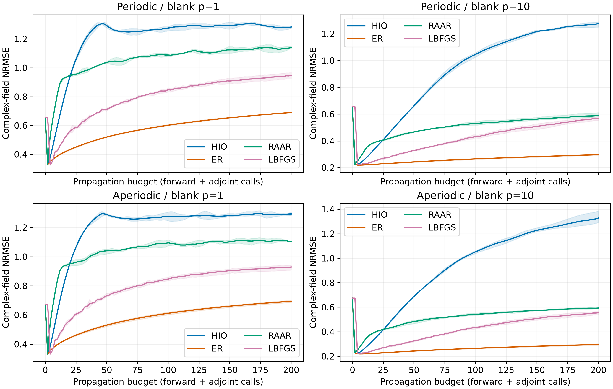
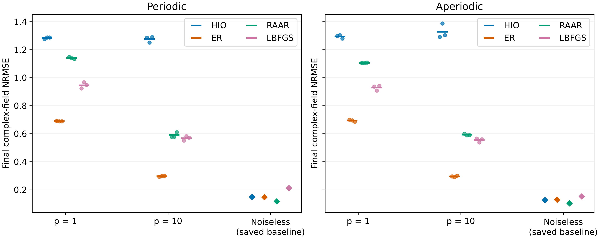

# Poisson 噪声阶段结果

48/48 MATLAB 求解完成；96 项最终误差独立复核通过。

|布局|空白计数 p|方法|复场 NRMSE（均值 ± SD）|相位 RMSE/rad（均值 ± SD）|
|---|---:|---|---:|---:|
|periodic|1|HIO|1.2828 ± 0.0066|1.7343 ± 0.0280|
|periodic|1|ER|0.6898 ± 0.0019|0.6061 ± 0.0154|
|periodic|1|RAAR|1.1405 ± 0.0071|1.5627 ± 0.0208|
|periodic|1|LBFGS|0.9464 ± 0.0224|1.0102 ± 0.0335|
|periodic|10|HIO|1.2753 ± 0.0216|1.6404 ± 0.0215|
|periodic|10|ER|0.2971 ± 0.0032|0.2066 ± 0.0034|
|periodic|10|RAAR|0.5895 ± 0.0183|0.5013 ± 0.0206|
|periodic|10|LBFGS|0.5686 ± 0.0157|0.4745 ± 0.0290|
|aperiodic|1|HIO|1.2936 ± 0.0124|1.7646 ± 0.0269|
|aperiodic|1|ER|0.6940 ± 0.0070|0.5864 ± 0.0073|
|aperiodic|1|RAAR|1.1059 ± 0.0024|1.4925 ± 0.0121|
|aperiodic|1|LBFGS|0.9291 ± 0.0180|0.9668 ± 0.0295|
|aperiodic|10|HIO|1.3276 ± 0.0520|1.7208 ± 0.0649|
|aperiodic|10|ER|0.2958 ± 0.0053|0.1985 ± 0.0011|
|aperiodic|10|RAAR|0.5929 ± 0.0067|0.4837 ± 0.0079|
|aperiodic|10|LBFGS|0.5546 ± 0.0145|0.4455 ± 0.0067|

均值曲线与三个种子的最小–最大范围；横轴为预算，早停时延续最后状态，实际调用数见CSV。

散点为三次重复，横线为均值；无噪声菱形是原始保存结果。不同预算下真值仅用于评价，未用于早停或选参。

空白参考 p=1/10 平均检测计数/像素/帧，全256×256帧平均。保持已知理想校准；不代表低光子条件下端到端校准性能。三次重复不作显著性结论。