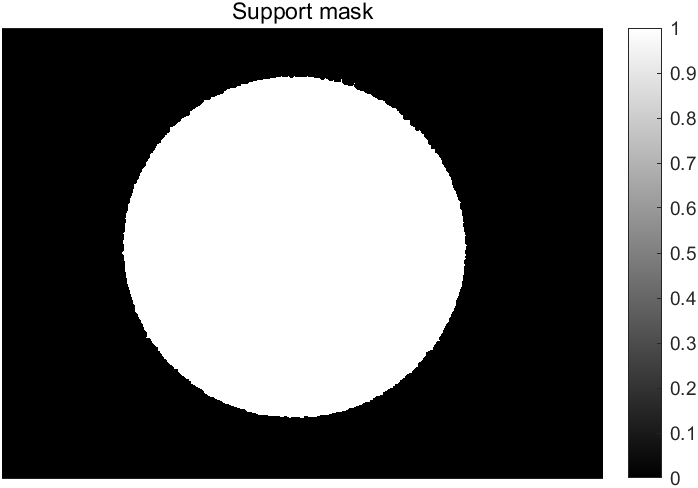
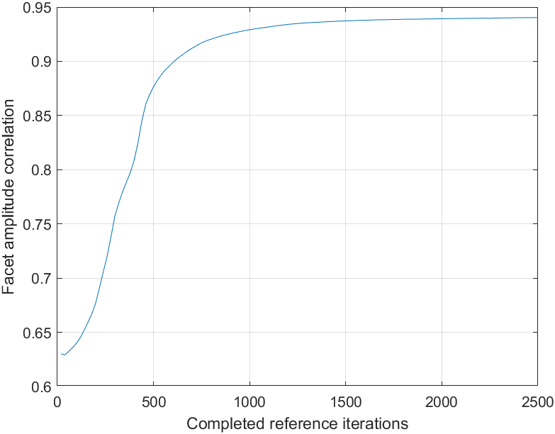
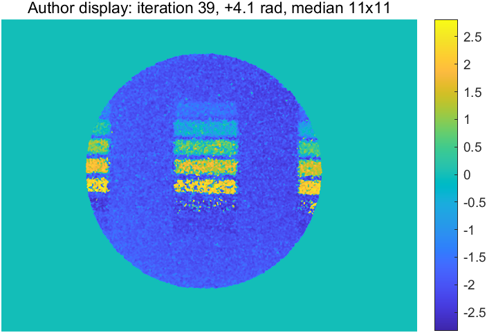
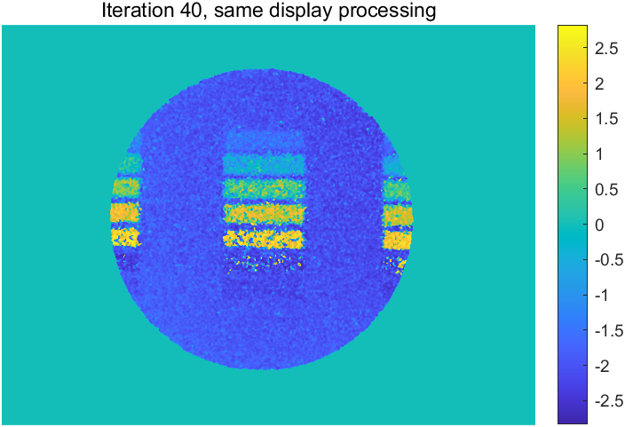

# FAST 作者公开示例复现报告

状态：作者 2500 次校准、40 次样品更新已完成。MATLAB 24.2.0.3361896 (R2024b) Update 10。

范围：公开相位目标示例。没有独立相位真值，不代表已复现论文所有实验、1 μm 分辨率或纳米级准确度。

## 输入—参数—输出

|步骤|输入|参数与操作|输出|
|---|---|---|---|
|读取|data/raw/data.mat|四幅 1920×2560 double 幅值；不再次开平方|两参考幅值、样品幅值、端面参考幅值、zs|
|支持域|amp_facet_ref|imbinarize 阈值 0.02；imclose，strel disk 半径 10 像素|mask|
|传播|当前复场|作者 prop.m；dp=2.2 μm，λ=532 nm；无新增 padding 或带限|传播后的复场|
|参考校准|两检测面参考幅值、mask|zs=[78.8,86] mm；零相位、mask 振幅初始化；β=0.2；2500 次|reference.mat：复场、相位、amp_cc|
|样品恢复|amp_far_sam、mask、参考相位|z=78.8 mm；mask×exp(i×参考相位)；β=0.2；40 次|sample.mat：第39、40次输出复场|
|参考校正|样品与参考相位|相位相减后 wrapToPi；不做相位展开|第40次原始校正相位|
|作者显示|第39次相位与参考|加4.1 rad，wrapToPi，乘mask，11×11中值滤波|08_author_display39.png|
|最终迭代对照|第40次相位与参考|同样的显示处理|09_final_iteration40_display.png|

校准每轮按 n=1、2 顺序更新；第二检测面使用第一检测面更新后的场，再对该轮两次输出取平均。不是两路独立并行更新。

HIO：支持域内接受反传场；域外为旧场减 0.2 倍反传场。域外迭代值不要求每次为零。

## 实测运行与一致性检查

- 校准耗时（包含启动检查、读入）：1127.8 s；总耗时：1170.1 s。
- 原算法传播次数：10080；另加验证传播：4。
- 最终参考振幅与实测端面振幅相关系数：0.940397。
- 参考检测面 A / B 幅值 NRMSE：0.281573 / 0.266209。
- 样品第 39 / 40 次幅值 NRMSE：0.294667 / 0.296671。
- 第39到40次的支持域内包裹相位变化 RMS：0.101489 rad。
- 第40次辅助迭代场的域外能量占比：0.067125。
- 停止原因：达到作者固定迭代次数，不是自动收敛判定。

幅值 NRMSE = 预测幅值与实测幅值差的二范数 / 实测幅值二范数；未做最优缩放；对原始 HIO 迭代场计算。数据一致性与振幅相关性不是独立相位准确度。

## 结果图

## 实现边界

冻结 legacy_fast 未改动。executed_main.m 保留实际执行脚本：仅去掉 clear/close all/clc，加入日志、有限数检查、检查点、2小时循环上限和保存钩子；默认隐藏新图窗。没有修改传播、精度、HIO、次数或显示处理。随机种子0，原初始化不使用随机数。单个当前GPU；无GPU时保留作者CPU分支。

作者 k 从2开始，因此校准显示/相关性记录位于实际第19、39、…、2499次，样品显示位于第9、19、29、39次。保留原显示结果，同时另存实际末次结果。原脚本没有执行倾斜校正（代码已注释）、样品面数字重聚焦或相位展开；本次也没有补加。4.1 rad 是作者显示常数，未把它解释为物理标定。

来源、哈希、环境与数值见 input_manifest.json、source_version.json、environment.mat、metrics.json、matlab.log。PNG 为可视化，定量处理应读取 MAT 文件。图像是否与论文指定面板吻合，仍需人工/独立参考核验；脚本完成不自动等于验证论文准确度。

