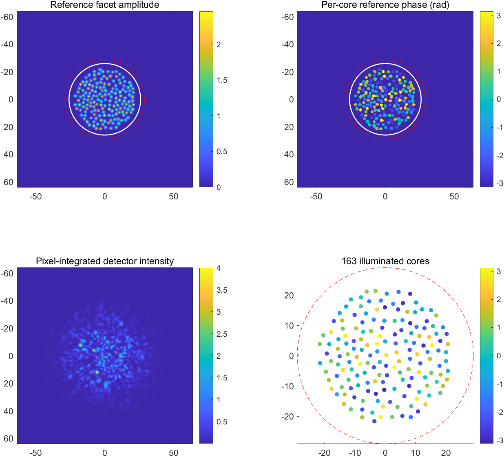
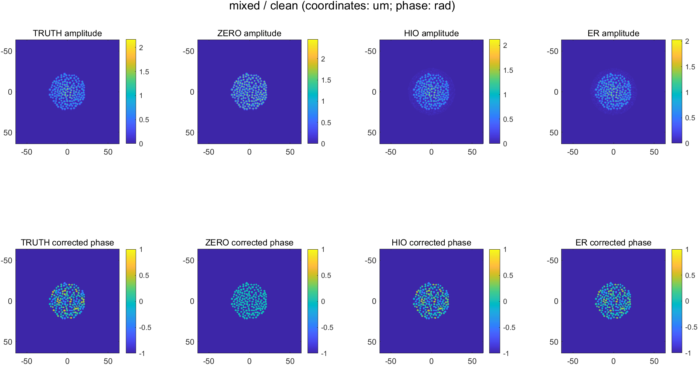
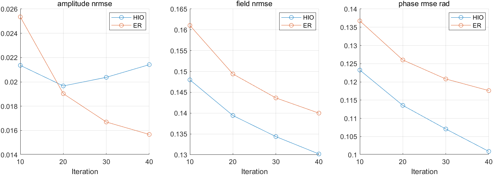
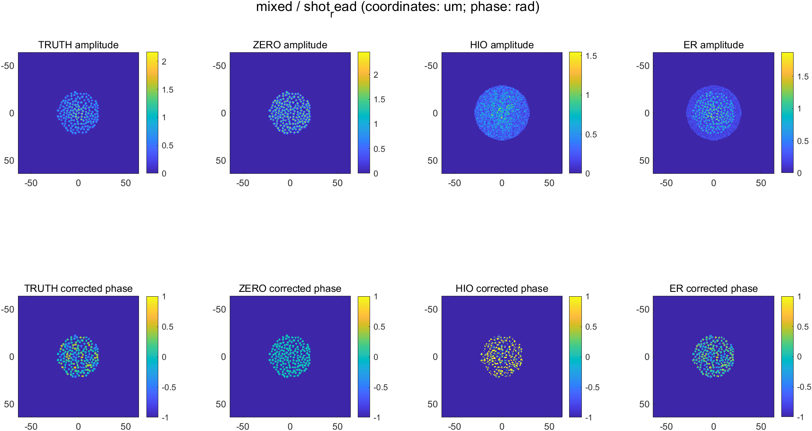
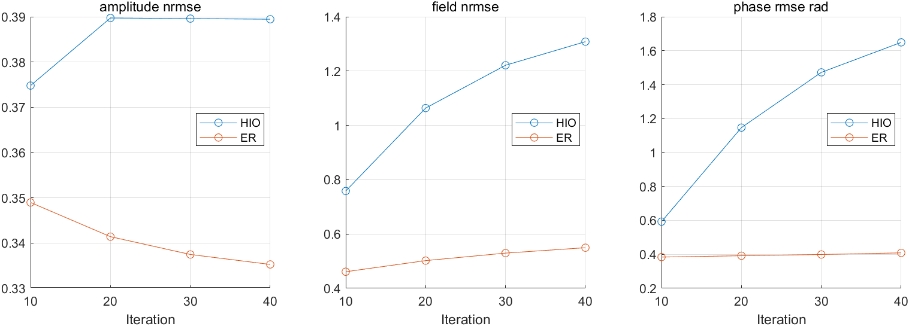

# Core-resolved MCF pilot

Run: mcf_20261003_224006_279_02

Layout: aperiodic; seed: 20261003; common reference power 1e-09, reference photoelectrons 200000.

## Model

163 illuminated cores; nominal hex pitch 3.2 um (layout geometry recorded separately); assumed mode radius 0.9 um with 10% variation. Per-core phase and gain fixed across reference/sample. Scalar diagonal transmission, sample at input facet.

Reconstruction: 256x256, 0.5 um object-space samples. Generation: 512x512, 0.25 um samples, 2x2 intensity integration. Wavelength 532 nm, detector z=120 um. Standard angular-spectrum operator in an explicitly separate benchmark.

Known synthetic reference calibration common to both solvers. Two reference intensity planes are saved for a future estimated-calibration test. Camera conditions in config.json; Poisson shot noise and read-noise sigma 1 electrons, exposure defined in config.json.

## Sampling audit

2x versus 4x reference-amplitude NRMSE: 0.00443179. Maximum detector edge-energy fraction: 5.46829e-05.

## Results at fixed final iteration

|Scene|Condition|Method|Iteration|Amplitude NRMSE|Full-field NRMSE|Core phase RMSE rad|Solver s|
|---|---|---|---:|---:|---:|---:|---:|
|mixed|clean|ZERO|0|0.616465|0.673866|0.258357|0.0000|
|mixed|clean|TRUTH_DIAGNOSTIC|0|0.0190118|0|0|0.0000|
|mixed|clean|HIO|40|0.0214178|0.130193|0.100927|0.1616|
|mixed|clean|ER|40|0.0156739|0.14|0.117608|0.1640|
|mixed|shot_read|ZERO|0|0.737387|0.673866|0.258357|0.0000|
|mixed|shot_read|TRUTH_DIAGNOSTIC|0|0.475719|0|0|0.0000|
|mixed|shot_read|HIO|40|0.389452|1.30833|1.64895|0.1700|
|mixed|shot_read|ER|40|0.335277|0.549527|0.408901|0.1623|

Each method/case: 40 iterations, 80 solver propagations, 4 scoring propagations. ZERO and TRUTH_DIAGNOSTIC each require one scoring propagation. Generation audit records its propagation count; unit tests have separate setup cost. One fixed fiber realization.

Measurement residual compares predicted detector amplitude with square-root measured pixel intensity. Full-field error covers the complete field; phase error uses a fixed bright-core ROI. A single global phase is aligned for scoring. TRUTH_DIAGNOSTIC measures the residual caused by fine/coarse sampling, pixel integration and noise.

## Figures

### mixed_clean

### mixed_shot_read

## Next physical refinements

Fit core geometry/mode widths to the public reference amplitude; add the documented imaging pupil and coordinate transform; evaluate estimated reference calibration, coupling and polarization drift.

Wall-clock including generation, tests, plots, scoring and IO: 9.91 s. CPU double; 600 s soft cap; fixed array dimensions, peak memory unmeasured.
